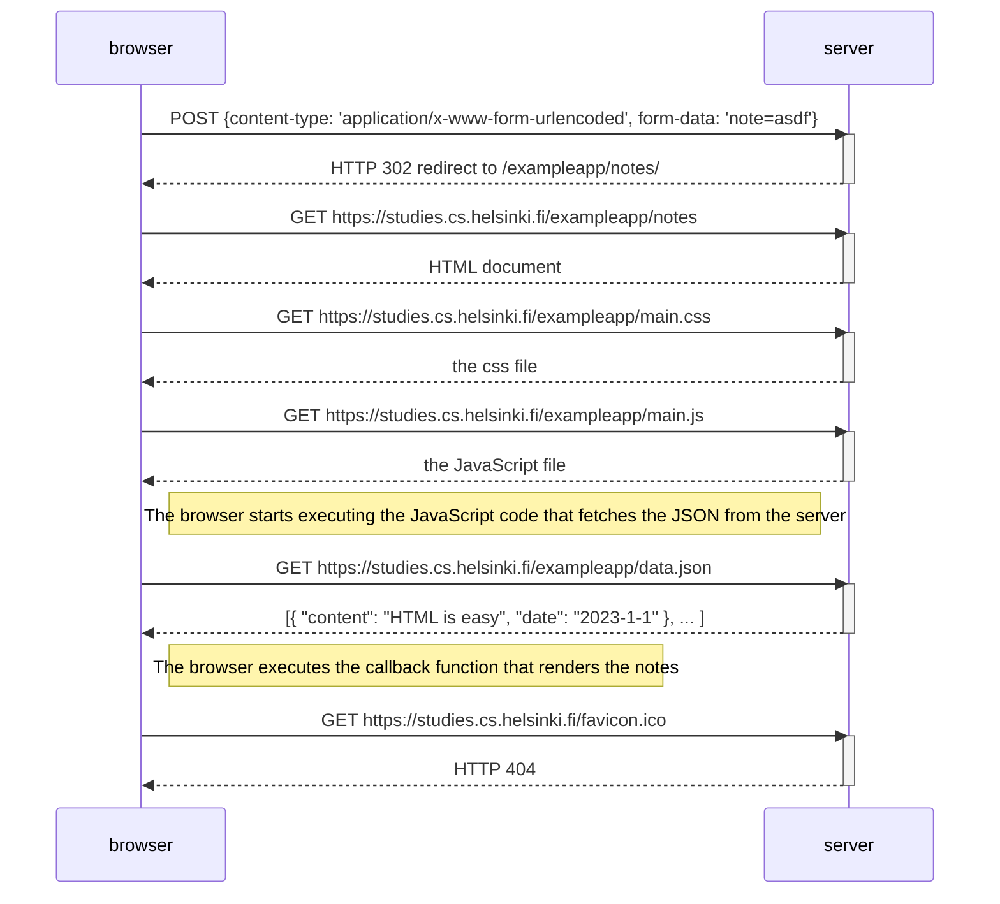

Kun kirjoitetaan `asdf` tohon tekstikenttään ja klikataan se nappi, selain lähettää dataa palvelimelle, johon vastauksena saa takas `HTTP 302`, joka myös käynnistää samaa prosessia, kuin esimerkkikaaviossa (josta puuttuu ovelasti ettei oo `favicon.ico`...), siksi mun ratkaisu sisältää 1:1 samat rivit...

