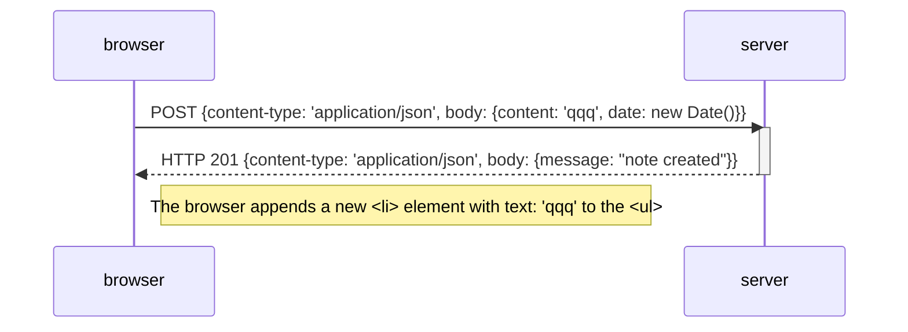

```mermaid
sequenceDiagram
    participant browser
    participant server
    
    browser->>server: POST {content-type: 'application/json', body: {content: 'qqq', date: new Date()}}
    activate server
    server-->>browser: HTTP 201 {content-type: 'application/json', body: {message: "note created"}}
    deactivate server
    
    Note right of browser: The browser appends a new <li> element with text: 'qqq' to the <ul>
    
```